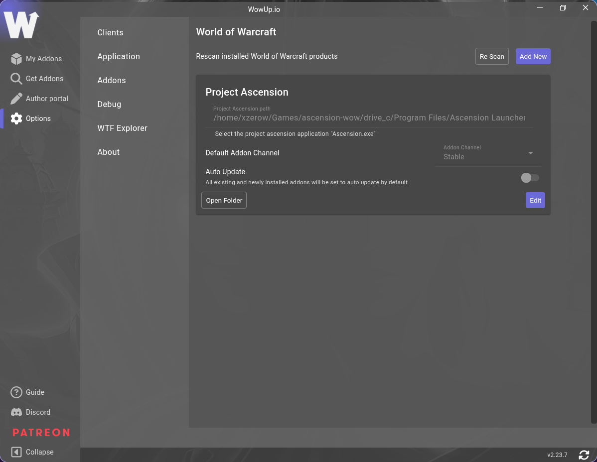
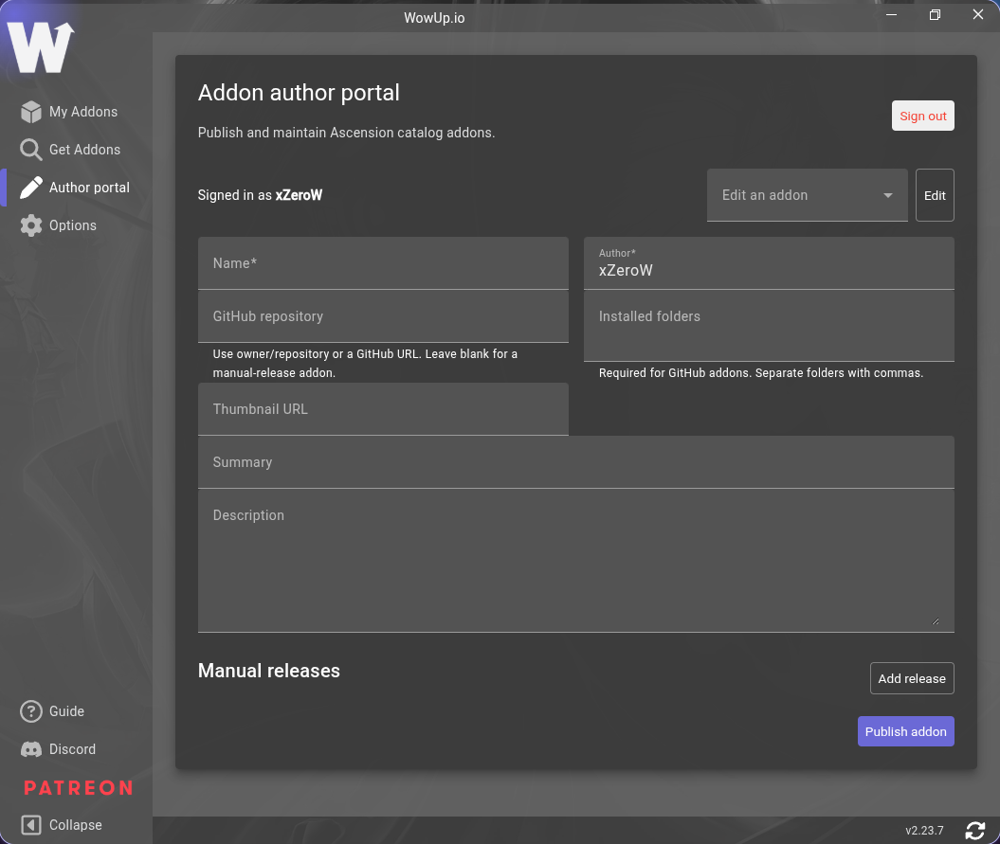

<p align="center">
  
</p>

# Ascension WowUp Client Repository

This is the repository for our [WowUp](https://wowup.io) client with [Ascension WoW](https://ascension.gg) support for Windows and Linux.

## WowUp


- Support for Ascension WoW addons
- Handle all your different World of Warcraft clients
- Auto updates

## Installing

### Latest Releases

The latest Ascension WowUp release is always available on [Releases](https://github.com/xZeroW/asc-wowup/releases)

## Adding a Client

WowUp automatically detects installed World of Warcraft clients. To add one manually:

1. Open **Options** from the sidebar and select **Clients**.
2. Click **Add New**.
3. In the file picker, select the game client executable, such as `Ascension.exe`.
4. Confirm the client details and select its default addon channel and auto-update preference.



## Ascension Addon Authors



### Publish an Addon

1. Open **Author portal** from the WowUp sidebar.
2. Select **Sign in with GitHub** and authorize WowUp.
3. Enter the addon **Name**, confirm the **Author**, and optionally add a thumbnail, summary, and description.
4. Choose a publishing method:
   - For a GitHub addon, enter its repository as `owner/repository` (or its GitHub URL) and list the installed addon folders, separated by commas.
   - For a manual-release addon, leave **GitHub repository** blank. Select **Add release** and enter the release ID, version, channel, installed folders, ZIP download URL, and ISO 8601 release date.
5. Select **Publish addon**. To update an existing addon, choose it from **Edit an addon**, select **Edit**, make your changes, and select **Save changes**.

### Prepare Release ZIPs

For manual releases, WowUp downloads and extracts the ZIP at the supplied download URL. The ZIP must contain each addon directory at its root, with its `.toc` file inside that directory. For example, `MyAscensionAddon-1.0.0.zip` should contain:

```text
MyAscensionAddon/
MyAscensionAddon/MyAscensionAddon.toc
MyAscensionAddon/...
```

Do not wrap the addon directory in another directory such as `my-repository-1.0.0/`. If an addon contains multiple folders, include each folder at the ZIP root and list every folder in the release's **Folders** field. Ensure the ZIP URL is publicly accessible before publishing.

### Publish GitHub Releases Automatically

For a GitHub addon, create `.github/workflows/release.yml` in the addon repository with the following workflow. Replace `MyAscensionAddon` with the folder or folders that WowUp installs. The folders are added directly to the ZIP root.

```yaml
name: Release addon

on:
  push:
    tags:
      - "v*"

permissions:
  contents: write

jobs:
  release:
    runs-on: ubuntu-latest
    steps:
      - uses: actions/checkout@v4
      - name: Package addon
        run: zip -r MyAscensionAddon-${{ github.ref_name }}.zip MyAscensionAddon
      - name: Create GitHub release
        uses: softprops/action-gh-release@v2
        with:
          files: MyAscensionAddon-${{ github.ref_name }}.zip
```

For multiple addon folders, add every folder to the `zip` command, for example `zip -r MyAddon-${{ github.ref_name }}.zip MyAddon MyAddon_Config`.

In the author portal, set **GitHub repository** to `owner/repository` and enter the same installed folders in **Installed folders**. Publish a new version by committing the change, creating a version tag, and pushing it:

```bash
git tag v1.0.0
git push origin v1.0.0
```

The workflow creates a GitHub Release and attaches the ZIP. Confirm the ZIP contains the addon folders at its root before relying on the release.

## Feedback

If you have a question, comment, or request we have several ways you can communicate them.

- Contact me Discord: xzerow
